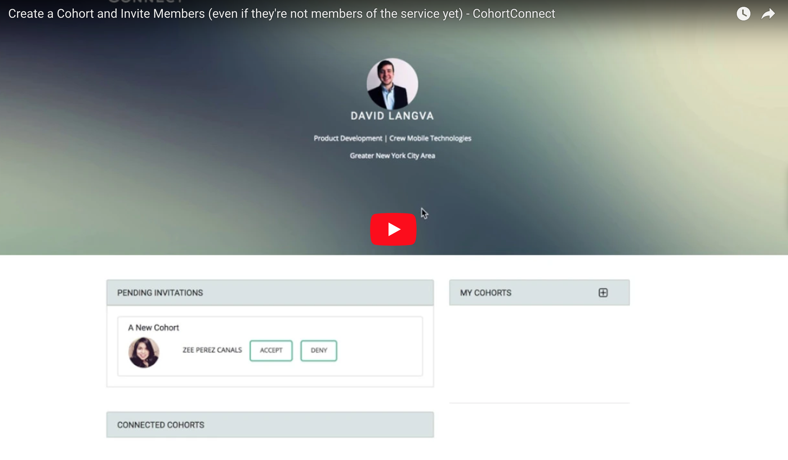
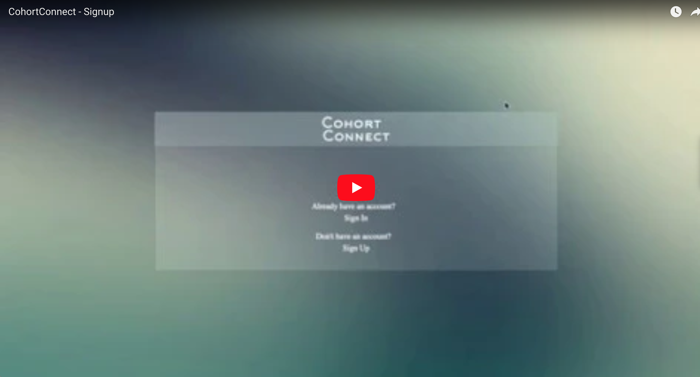

# Cohort Connect

Need to get a team together on linkedin, but all you have is a list of email addresses? No problem. Just feed the emails into cohort connect and each person will receive an email to join your group. When they sign up, they will appear on your groups main page.

Now all members can easily see who they should connect with.

Great for bootcamp cohorts where people forget to add their classmates because they assume they're already all connected.

### Prerequisites

Ruby 2.5.0
Rails

### Installing

A step by step series of examples that will get a development env running

In terminal navigate to folder you want to save the project

clone the project
```
git clone https://github.com/DavidLangva/CohortConnect.git
```

navigate into the project folder
```
cd cohortConnect
```

install dependencies
```
bundle install
```
create the database and migrate
```
rake db:create
rake db:migrate
```

start the rails server
```
rails s
```

Go to browser and navigate to localhost:3000 and the site should be live. 

## Inviting Users to CohortConnect
When you create a cohort, you can enter in a comma separated list of email addresses for the people you want to join your cohort.

If their email exists in our database, their account receives an in-app invite to your cohort.

In this case, the email is not present in our database.

We create a placeholder account with that email address and an in-app invite linked to it. We also attach an invitation token. We then send an email to that email address with a link to claim their account. 

When they click that link, we verify that the attached invitation token is the one initially created for the placeholder account. When they allow linkedin, we populate the rest of their account information as normal.

Because the in-app invitation to your cohort was placed on the account when it was still a placeholder, the new user still have access to it.

They can accept the in-app invite to be added to your cohort.

<a target="_blank" href="https://www.youtube.com/watch?v=MxqPeF9QiHw">
  
<a>

## Sign Up with OAuth2.0

Account creating via OAuto2 for linked in.

By allowing CohortConnect to Access your Linkedin profile, we automatically create an account for you with all your linkedin info.

<a  target="_blank" href="https://www.youtube.com/watch?v=IJXcvPobqkQ">
  
<a>

## Built With

* [Devise](https://github.com/plataformatec/devise) - User Authentication 


## Authors

* **Zee Perez Canals** - *Initial work* - [zeepc](https://github.com/zeepc)
* **Janelle Ballack** - *Initial work* - [Jnl526](https://github.com/Jnl526)
* **David Langva** - *Initial work* - [DavidLangva](https://github.com/PurpleBooth)

See also the list of [contributors](https://github.com/your/project/contributors) who participated in this project.

## License

This project is licensed under the MIT License - see the [LICENSE.md](LICENSE.md) file for details

## Acknowledgments

* *Travis Pew* - [travisp](https://github.com/travisp)
  For his awesome [post](https://github.com/scambra/devise_invitable/issues/177 "Correcting invitable synchronization with omniauthable") on integrating oauth with devise-invitable gem

